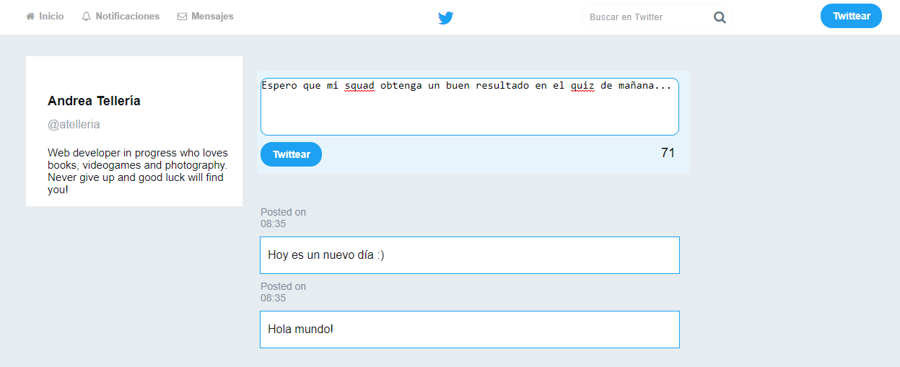

## Twitter

#### Descripción:
Este repositorio contiene una réplica básica de la red social Twitter para desktop. Pusimos en práctica nuestros conocimientos sobre eventos en Javascript para darle mayor interacción a nuestra página web.

La página se verá de la siguiente manera en el navegador:

  

#### Herramientas utilizadas:
* HTML
* CSS
* Javascript
